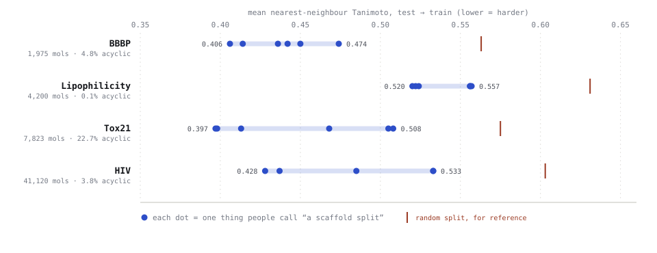
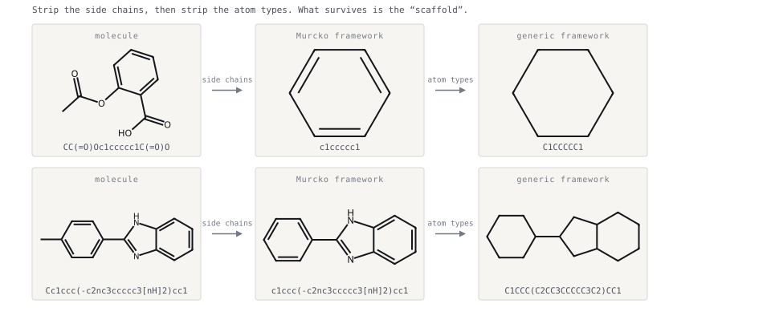
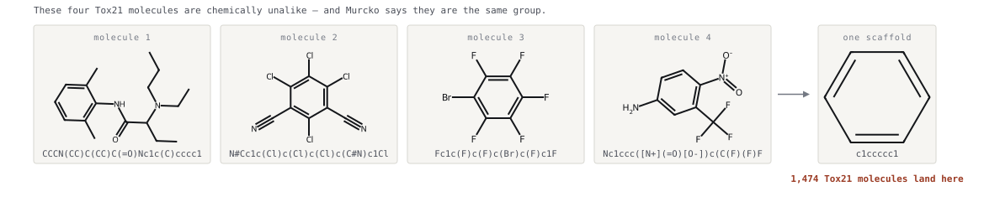
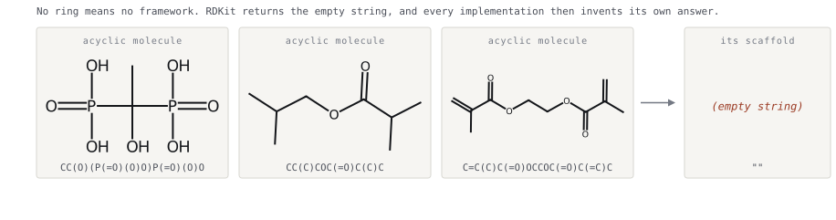
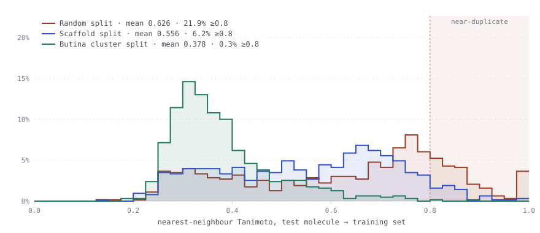

# Stop Naming Your Splits. Start Measuring Them.

*"Scaffold split" is not one thing. Two implementation choices that no paper reports moved a reported AUC by 0.19 on one dataset and did nothing on another — and which one bites you depends on a property of your data you probably haven't checked.*



*Every blue dot is a split someone would describe in a methods section as "a scaffold split." They differ only in choices that go unreported. On Tox21 and HIV the spread **within** that one name (0.111, 0.105) is larger than the gap between the best scaffold split and a plain random split (0.067, 0.070).*

---

We argue about splits by name. Someone says "we used a scaffold split" and the room relaxes, because a scaffold split is the hard one. Someone says "random split" and the room gets suspicious.

But a split is not its name. A split is a *distance* — the chemical gap it puts between training and test — and that distance is decided as much by undocumented implementation details as by the rule you cite in your methods section.

I measured this across four MoleculeNet datasets, with five seeds, and trained a model on every split so I could report what the choices actually cost. Three results:

1. **Two free choices inside "scaffold split" swing a reported score by up to 0.185 AUC.** Neither is in anyone's methods section.
2. **Which choice matters is dataset-dependent**, and it tracks a statistic you can compute in ten seconds. On the dataset where 22.7% of molecules have no scaffold, the acyclic policy is everything and group ordering is inert. On another dataset the reverse.
3. **Split distance predicts the reported score** (pooled Spearman +0.67, p ≈ 9×10⁻⁶) — so this is not a geometric curiosity, it's your leaderboard.

I also got a fourth result by auditing my own first draft, which had a confounded comparison in it. That story is at the end, because it's the most useful part.

---

## This alarm is not new. The quantification is what's missing.

Worth placing this honestly before going further:

- **Wallach & Heifets (2018)** introduced *AVE bias* and showed that redundancy between training and validation sets explains much of the reported performance of ligand-based methods. ([JCIM](https://pubs.acs.org/doi/10.1021/acs.jcim.7b00403), [arXiv:1706.06619](https://arxiv.org/abs/1706.06619))
- **Steshin's Lo-Hi benchmark (NeurIPS 2023)** makes essentially the measurement below and reports that under a recommended scaffold split, 78% of test molecules still have a training neighbour above 0.4 Tanimoto. ([arXiv:2310.06399](https://arxiv.org/abs/2310.06399))
- **Yang et al. (2019)**, the chemprop paper, already randomizes scaffold-set assignment in its `scaffold_balanced` splitter — so the fact that assignment order is a free choice is documented, not discovered. ([JCIM](https://pubs.acs.org/doi/10.1021/acs.jcim.9b00237), [arXiv:1904.01561](https://arxiv.org/abs/1904.01561))

So "scaffold splits leak" is old news. What I couldn't find anywhere was a number for **what the undocumented choices cost you** — held constant one at a time, over multiple seeds, with a model attached. That's what follows.

---

## First: what a scaffold actually is

Bemis and Murcko (1996) split a molecule into four disjoint parts — **ring systems**, **linkers** (the paths joining rings), **side chains**, and the **framework**, which is rings plus linkers with the side chains deleted. That framework is what everyone now means by "the scaffold." A scaffold split groups molecules by it, so no framework appears on both sides of the split.

Strip the side chains, then optionally strip the atom types as well:



*Two real molecules through the reduction. Aspirin keeps only its benzene ring — the whole acetyl ester and the carboxylic acid are side chains, so they vanish. `MakeScaffoldGeneric` then turns every atom into carbon and every bond into a single bond, which is the "generic framework" row in the tables below.*

Two consequences fall straight out of that definition, and between them they explain almost everything in this post.

### Stripping side chains merges molecules that are not alike



*An anaesthetic-like amide, a polychlorinated dinitrile, a bromo-fluoroarene and a nitro-aniline. Every ring here is a plain benzene, so every side chain is deleted and all four reduce to `c1ccccc1`. **1,474 Tox21 molecules — 18.8% of the dataset — collapse into that one group**, which then has to move to one side of the split as a single indivisible block. Mean pairwise similarity inside it is 0.152, against 0.082 for the dataset as a whole: barely more coherent than a random sample.*

### And a molecule with no ring has no scaffold at all



*There is no framework to extract, so `MurckoScaffoldSmiles` returns the empty string. It is not an error and nothing warns you. On Tox21 this is **22.7% of the dataset** — and what happens to those molecules next is the single largest lever in this whole post.*

---

## The measurement

For each test molecule, find its nearest neighbour in the training set by Morgan fingerprint Tanimoto.

```python
from rdkit import DataStructs
from rdkit.Chem import rdFingerprintGenerator

gen = rdFingerprintGenerator.GetMorganGenerator(radius=2, fpSize=2048)
fps = [gen.GetFingerprint(m) for m in mols]

train_fps = [fps[i] for i in train_idx]
nn = [max(DataStructs.BulkTanimotoSimilarity(fps[i], train_fps)) for i in test_idx]

print(f"mean NN Tanimoto: {sum(nn) / len(nn):.3f}")
```

The mean is a summary; the distribution is the story. Here are three splits of the same 4,200 ChEMBL compounds (MoleculeNet Lipophilicity):



The random split puts **21.9% of test molecules within 0.8 Tanimoto of something in training** — including a spike at 1.0, molecules whose fingerprint is identical to a training example. A scaffold split cuts that to 6.2%. A Butina cluster split cuts it to 0.3%.

---

## What the splits deliver

Four datasets, 70/15/15, deduplicated to unique canonical SMILES, Morgan r=2/2048. Shuffled arms are mean ± sd over 5 seeds; deterministic arms have no seed. **Lower = harder test set.**

| Split | BBBP (1,975) | Lipophilicity (4,200) | Tox21 (7,823) | HIV (41,120) |
|---|---|---|---|---|
| Random | 0.563 ± .010 | 0.631 ± .008 | 0.575 ± .002 | 0.603 ± .004 |
| Scaffold, acyclic = own group | 0.450 ± .040 | 0.556 ± .004 | 0.505 ± .005 | 0.533 ± .004 |
| Scaffold, acyclic = pooled | 0.474 ± .034 | 0.557 ± .008 | **0.413 ± .077** | 0.533 ± .004 |
| Scaffold, acyclic = Butina | 0.442 ± .024 | 0.556 ± .004 | 0.468 ± .010 | — |
| Scaffold, pooled + DeepChem order | 0.436 | 0.520 | 0.398 | 0.437 |
| Generic framework | 0.439 ± .028 | 0.512 ± .020 | 0.506 ± .017 | 0.517 ± .006 |
| Butina cluster (0.4) | 0.389 ± .016 | 0.384 ± .012 | 0.460 ± .011 | — |

Two things jump out. The scaffold rows are not one row — they span 0.398 to 0.505 on Tox21 alone, all of them legitimately called "a scaffold split." And one arm has a standard deviation of 0.077, which is larger than most of the differences people report between methods.

---

## Choice #1: what you do with molecules that have no scaffold

`MurckoScaffoldSmiles` returns `""` for any molecule with no ring. There's no principled scaffold for ethanol, and implementations disagree:

- **DeepChem's `ScaffoldSplitter`** keys on the returned string, so every acyclic molecule lands in **one shared group** that moves as a unit.
- **The common alternative** falls back to the molecule's own SMILES, giving each acyclic its own group — i.e. a random split for that slice.
- **Or** cluster them by fingerprint, which is what I'd argue for.

Holding assignment order fixed (shuffled, 5 seeds) and changing *only* this:

| Dataset | Acyclic % | acyclic = own | acyclic = pooled | Δ score |
|---|---|---|---|---|
| Lipophilicity | 0.1% | 0.634 ± .024 | 0.622 ± .013 | −0.012 |
| HIV | 3.8% | 0.797 ± .037 | 0.807 ± .019 | +0.010 |
| BBBP | 4.8% | 0.852 ± .048 | 0.876 ± .029 | +0.024 |
| **Tox21** | **22.7%** | **0.826 ± .081** | **0.641 ± .126** | **−0.185** |

*(BBBP/Tox21/HIV are AUC, Lipophilicity is Spearman.)*

On Tox21 this single undocumented choice is worth **0.185 AUC** — larger than the gap between most published methods on this benchmark. On Lipophilicity it's worth nothing, because Lipophilicity is 0.1% acyclic.

Note the error bars too. Pooling acyclics on Tox21 creates one 1,775-molecule mega-group; whichever side of the split it lands on dominates everything else, giving ±0.126 AUC across seeds. That configuration isn't merely harder — it's *unstable*, and a single-seed paper would never see it.

---

## Choice #2: how you break ties between equal-sized scaffold groups

DeepChem sorts scaffold groups largest-first. But roughly **75% of scaffold groups contain exactly one molecule** — on every dataset here, from 2k to 41k compounds — so "sort by size" leaves most of the ordering undetermined. Something has to break the ties, and that something is an implementation detail.

DeepChem breaks them by first-index descending:

```python
scaffold_sets = [s for (scaffold, s) in sorted(
    scaffolds.items(), key=lambda x: (len(x[1]), x[1][0]), reverse=True)]
```

Change only that tie-break, holding the grouping rule and the size ordering fixed:

| Dataset | DeepChem tie-break | Different tie-break |
|---|---|---|
| Lipophilicity | 0.580 | 0.564 |
| Tox21 | 0.746 | 0.744 |
| HIV | 0.779 | 0.757 |
| **BBBP** | **0.781** | **undefined — test set is 100% positive class** |

On BBBP one tie-break gives a working benchmark and another gives a test set with no negatives at all, so AUC cannot be computed. Same grouping rule, same sort key, same fractions.

To be clear, because this is the kind of claim that gets misread: **DeepChem's own tie-break is the good one here.** I found the degenerate case only because I initially wrote the sort as `sorted(groups, key=len, reverse=True)`, which leaves ties to dict insertion order. That's the natural way to write it, it looks equivalent, and it isn't.

---

## Does any of this change the number you'd report?

This is the question my first draft never answered. A RandomForest (200 trees, Morgan counts) on every split:

| Split | BBBP AUC | Lipophilicity ρ | Tox21 AUC | HIV AUC |
|---|---|---|---|---|
| Random | **0.916 ± .007** | **0.702 ± .017** | 0.810 ± .040 | **0.819 ± .011** |
| Scaffold, acyclic = own | 0.852 ± .048 | 0.634 ± .024 | 0.826 ± .081 | 0.797 ± .037 |
| Scaffold, pooled + DeepChem order | 0.781 | 0.580 | 0.746 | 0.779 |
| Generic framework | 0.878 ± .045 | 0.579 ± .026 | 0.754 ± .134 | 0.792 ± .034 |
| Butina cluster | 0.859 ± .026 | 0.505 ± .045 | 0.808 ± .103 | — |

Across all 36 (dataset, split) combinations, z-scored within dataset, mean NN Tanimoto correlates with the reported score at **Spearman +0.67, p ≈ 9×10⁻⁶**. Per dataset it ranges from +0.88 on HIV and +0.85 on Lipophilicity down to +0.39 on Tox21, which is not significant on its own. So: a strong pooled relationship, not a law.

And one honest anomaly — **on Tox21 the scaffold split scores *higher* than the random split** (0.826 vs 0.810), the opposite of the standard story. It's within the error bars, but it's there, and anyone claiming "scaffold splits always lower your score" should look at it.

---

## The trap I fell into: circular evaluation

My first draft recommended Butina clustering on the strength of this: it drove near-duplicates to 0.2–1.8% where scaffold splits left 2–9%.

That recommendation was circular. I clustered molecules by Morgan/Tanimoto and then scored the split by Morgan/Tanimoto nearest-neighbour distance. Butina wins that comparison because it directly optimises the thing being measured.

The fix is to score with a fingerprint that had no part in building the split. Re-measuring with MACCS keys — 166 substructure keys, a completely different basis:

| Split | BBBP | Lipophilicity | Tox21 | HIV |
|---|---|---|---|---|
| Random | 0.823 | 0.872 | 0.843 | 0.869 |
| Scaffold, acyclic = own | 0.758 | 0.843 | 0.801 | 0.840 |
| Scaffold, own + DeepChem order | **0.718** | 0.828 | **0.791** | **0.780** |
| Butina cluster | 0.755 | **0.782** | 0.792 | — |

Butina's advantage largely evaporates. On BBBP a plain DeepChem-ordered scaffold split produces a *harder* test set (0.718) than Butina (0.755). On Tox21 they tie. Only on Lipophilicity does Butina still clearly win.

**If you build a split by optimising a similarity metric, you cannot evaluate that split with the same metric.** I'd have shipped this error if I hadn't had the draft torn apart by a reader who spotted it.

---

## What to actually do

1. **Report mean NN Tanimoto and the ≥0.8 share next to your metric.** Twenty lines, and it makes results comparable across papers that currently aren't.
2. **Compute your acyclic fraction before you pick a scaffold splitter.** If it's over ~10%, the acyclic policy is a bigger lever than the split family, and you must state which you used.
3. **Run more than one seed, and report the spread.** Some of these configurations have ±0.12 AUC seed variance. A single-seed comparison between two methods that differ by 0.02 is measuring nothing.
4. **Never evaluate a split with the metric that built it.** Score with an independent representation, or you'll conclude your clustering method is the best splitter, which it will be, by construction.
5. **Scope your negative results.** If you ran an ablation on a split whose test molecules sat at 0.60 mean similarity to train, you have evidence about the interpolation regime. You do not have evidence about extrapolation, because it was never on your test set. That doesn't make the result wrong. It makes it narrower than the sentence you wrote about it.

The measurement takes a minute. Run it before you trust the split's name — especially when the name is the reassuring one.

---

## Coda: I published the confound first

The first version of this post claimed that group *ordering* was the big undocumented lever, and quoted a 0.078 swing on Tox21 as proof.

That comparison was confounded. My "random order" arm gave every acyclic molecule its own group; my "DeepChem order" arm pooled them. The two arms differed in **grouping rule as well as ordering** — and I headlined the effect on Tox21, the one dataset out of four where 22.7% acyclics made that confound maximal. On the other three the ordering effect was 0.015–0.029, not 0.078.

I'd also labelled an arm "DeepChem order" without running DeepChem. When I finally transcribed `ScaffoldSplitter` from the installed source and ran it properly, the real algorithm behaved differently from my reimplementation — which is how I found the tie-break result that's now the more interesting half of this post.

The irony is not lost on me. A post arguing that you should measure your split instead of trusting its label, containing a comparison whose label didn't match what it measured.

That's the actual lesson, and it's cheaper to learn from my draft than your paper: **the mislabelled arm looked completely fine until someone ran the code.**

---

## Reproducing this

MoleculeNet CSVs from DeepChem's S3 bucket:

```
https://deepchemdata.s3-us-west-1.amazonaws.com/datasets/BBBP.csv
https://deepchemdata.s3-us-west-1.amazonaws.com/datasets/Lipophilicity.csv
https://deepchemdata.s3-us-west-1.amazonaws.com/datasets/tox21.csv.gz
https://deepchemdata.s3-us-west-1.amazonaws.com/datasets/HIV.csv
```

- [`split_audit.py`](split_audit.py) — the full audit: grouping and ordering as orthogonal axes, 5 seeds, MACCS cross-check, RF training.
- [`verify_deepchem.py`](verify_deepchem.py) — DeepChem's `ScaffoldSplitter` transcribed verbatim and run under its own defaults, to check my reimplementation.
- [`make_histogram.py`](make_histogram.py), [`make_spread.py`](make_spread.py) and [`make_scaffold_figs.py`](make_scaffold_figs.py) — the figures. The molecule drawings are RDKit depictions of real dataset entries, not illustrations.
- [`audit_results.json`](audit_results.json) — every number in this post.

Needs `rdkit`, `pandas`, `numpy`, `scikit-learn`, `scipy`. RDKit 2022.09+ for `rdFingerprintGenerator`. Butina is skipped above 15,000 molecules — the distance matrix is O(n²) — so the Butina and hybrid rows are absent for HIV.

**References**

- Bemis & Murcko, *The Properties of Known Drugs. 1. Molecular Frameworks*, J. Med. Chem. 39(15), 1996.
- Butina, *Unsupervised Data Base Clustering Based on Daylight's Fingerprint and Tanimoto Similarity*, J. Chem. Inf. Comput. Sci. 39(4), 1999.
- Wu et al., *MoleculeNet: A Benchmark for Molecular Machine Learning*, Chem. Sci. 9, 2018.
- Wallach & Heifets, *Most Ligand-Based Classification Benchmarks Reward Memorization Rather than Generalization*, JCIM 58(5), 2018.
- Yang et al., *Analyzing Learned Molecular Representations for Property Prediction*, JCIM 59(8), 2019.
- Steshin, *Lo-Hi: Practical ML Drug Discovery Benchmark*, NeurIPS 2023 Datasets & Benchmarks.
